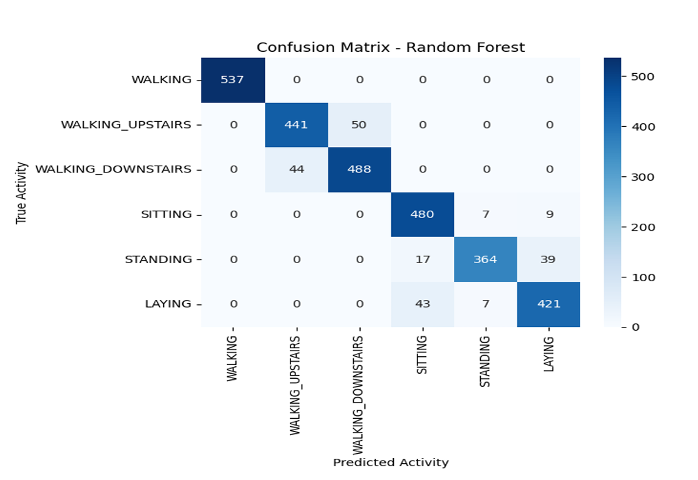

# 🧠 SmartMove: AI-Based Human Activity Recognition using Smartphone Sensors

SmartMove is a machine learning-based Human Activity Recognition (HAR) system that uses smartphone sensor data (accelerometer and gyroscope) to classify six common human activities:  
**WALKING, WALKING_UPSTAIRS, WALKING_DOWNSTAIRS, SITTING, STANDING, and LAYING.**

## 📊 Overview

This project applies three machine learning models:
🟢 Random Forest
🔵 Support Vector Machine (SVM)
🔴 K-Nearest Neighbors (KNN)

Best Accuracy: **96% using SVM**

---

## 📂 Dataset

We use the [UCI HAR Dataset](https://archive.ics.uci.edu/dataset/240/human+activity+recognition+using+smartphones) which contains sensor signals from 30 participants performing various daily activities.

---

## 🔧 Tech Stack

- Python (pandas, sklearn, seaborn, matplotlib)
- Machine Learning (RF, SVM, KNN)
- Jupyter Notebook

---

## 🚀 How to Run

1. Clone the repo  
2. Download the UCI HAR Dataset and place it in a `data/` folder as structured in the notebook  
3. Run the Jupyter notebook:

bash:

jupyter notebook SmartMove_HAR.ipynb

## 📈 Results

| Model | Accuracy |
|-------|----------|
| SVM   | 96%      |
| RF    | 93%      |
| KNN   | 88%      |

Confusion matrices are plotted for all models.

---

## 🖼️ Screenshots

### 🔵 SVM Confusion Matrix

### 🟢 Random Forest Confusion Matrix

### 🔴 KNN Confusion Matrix

📬 Author
Khushi Gupta
🌐 https://github.com/Khushi0389
